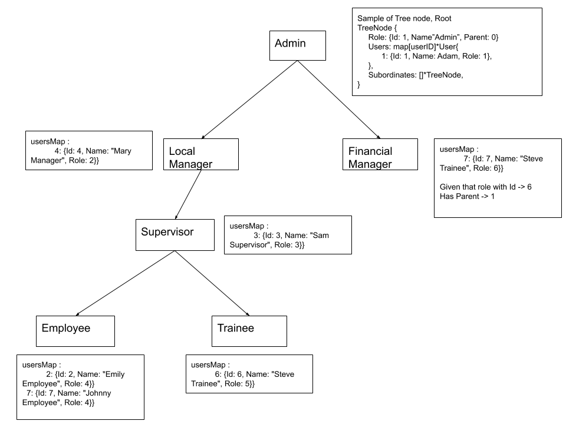

# user-hierachy-tree

## Introduction

User Hierachy tree is a data structure used to store Roles in a tree with references to each role's subordinate.

### main functionality

```
seRoles(roles)
setUsers(users)
getSubordinates(userID)
```

## Usage

roles request in json fomat sample
```
[	{
	"Id": 1,
	"Name": "System Administrator",
	"Parent": 0
	}]
```

users request in json fomat sample
```
[	{
	"Id": 1,
	"Name": "Adam Administrator",
	"Role": 1
  }
]
```
assuming user's role refers to role's Id.

func main() {
	//initialise tree
	userHierachyTree = &UserHierachyTree{}

	rolesRequest := SampleRolesRequest
	usersRequest := SampleRolesRequest

	setRolesErr := setRoles(rolesRequest)
	if setRolesErr != nil {
		fmt.Printf("error setting roles, msg: %v", setRolesErr.Error())
		os.Exit(1)
	}

	setUsersErr := setUsers(usersRequest)
	if setUsersErr != nil {
		fmt.Printf("error setting users, msg: %v", setUsersErr.Error())
		os.Exit(1)
	}
	_, subordinatesErr := getSubordinates(3)
	if subordinatesErr != nil {
		fmt.Printf("error getting subordinates, msg: %v", subordinatesErr.Error())
		os.Exit(1)
	}
}
```

## Tech used
- Go

## Implementation overview

Assumptions:
- Multiple roles can have the same Parent
- Id for Role and User is unique identifier

The following is a visual demo of the data structure


As shown from tree above, `TreeNode` stores the `Role`, a map of users where userID is key, and reference to direct subordinates `TreeNode`

`setRoles(roles)`
- Unmarshals payload and maps to `Role` struct
- Sorts roles by parent
- Builds tree recursively by creating tree nodes referencing each role to it's parent

`setUsers(users)`
- Unmarshals payload and maps to `User` struct
- Sorts users by roles, helps with performance when looking for tree node to update
- Updates tree nodes users map from root, recursively.

`getSubordinates(userId)`
- finds tree node with user map that contains given `userID`
- recursively returns the subordinates and it's subordinates of found tree node

### simple app included
make run print same roles, users, and results from getting subordinates for user id 3 and 1
```
make
build                          Run your application
clean                          Trash binary files
install                        Compile sources and build binary
run                            Run your application
test                           Run all tests
usage                          List available targets
```
